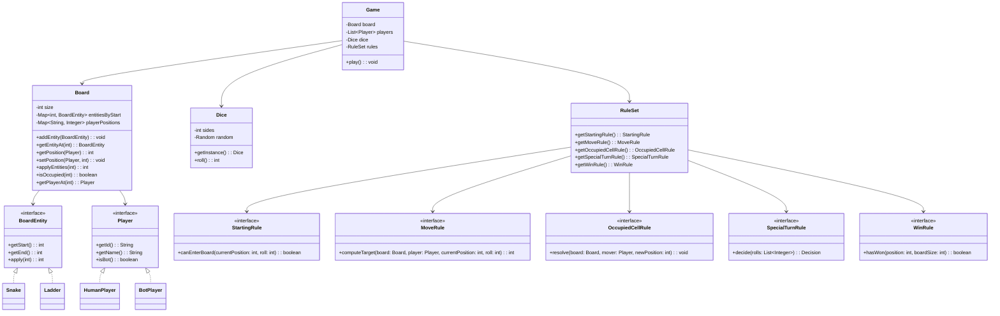

## Snake & Ladder - Design and Class Diagram

This project implements a flexible, strategy-driven Snake & Ladder game in Java.

### Goals
- **Extensible rules** via strategies (start, move, occupied cell, special turn, win)
- **Pluggable board** creation (factories) with proper snake/ladder placement
- **Clear engine** handling turn management, dice rolling, collisions, and win conditions

### Class Diagram (high level)

### Default Rule Set
- **Starting**: must roll a 6 to leave start (position 0)
- **Movement**: exact finish required; overshoot cancels the move for that roll
- **Occupied cell**: landing on an occupied cell sends the occupant back to start
- **Special turn**: roll a 6 for an extra roll; three 6s in a row cancels the entire turn (revert to start of turn)
- **Win**: first player to reach the final cell wins

### Board Creation
`BoardFactory` places snakes and ladders with constraints:
- Valid ranges (no starts at 1 or final cell)
- Directional validity (ladder goes up, snake goes down)
- Unique starts per entity

### Run
`Main` demonstrates a standard game with two players and the default rules.

