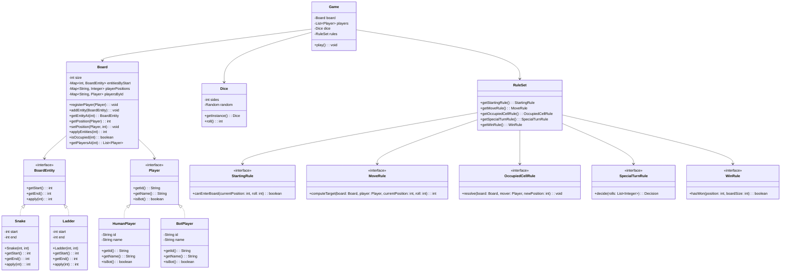

## Snake & Ladder - Class Diagram

### Class Diagram (high level)

```mermaid
classDiagram
    class Game {
      -Board board
      -List~Player~ players
      -Dice dice
      -RuleSet rules
      +play(): void
    }

    class Board {
      -int size
      -Map~int, BoardEntity~ entitiesByStart
      -Map~String, Integer~ playerPositions
      -Map~String, Player~ playersById
      +registerPlayer(Player): void
      +addEntity(BoardEntity): void
      +getEntityAt(int): BoardEntity
      +getPosition(Player): int
      +setPosition(Player, int): void
      +applyEntities(int): int
      +isOccupied(int): boolean
      +getPlayersAt(int): List~Player~
    }

    class Dice {
      -int sides
      -Random random
      +getInstance(): Dice
      +roll(): int
    }

    class RuleSet {
      +getStartingRule(): StartingRule
      +getMoveRule(): MoveRule
      +getOccupiedCellRule(): OccupiedCellRule
      +getSpecialTurnRule(): SpecialTurnRule
      +getWinRule(): WinRule
    }

    class Player {
      <<interface>>
      +getId(): String
      +getName(): String
      +isBot(): boolean
    }
    class HumanPlayer {
      -String id
      -String name
      +getId(): String
      +getName(): String
      +isBot(): boolean
    }
    class BotPlayer {
      -String id
      -String name
      +getId(): String
      +getName(): String
      +isBot(): boolean
    }
    Player <|.. HumanPlayer
    Player <|.. BotPlayer

    class BoardEntity {
      <<interface>>
      +getStart(): int
      +getEnd(): int
      +apply(int): int
    }
    class Snake {
      -int start
      -int end
      +Snake(int, int)
      +getStart(): int
      +getEnd(): int
      +apply(int): int
    }
    class Ladder {
      -int start
      -int end
      +Ladder(int, int)
      +getStart(): int
      +getEnd(): int
      +apply(int): int
    }
    BoardEntity <|.. Snake
    BoardEntity <|.. Ladder

    Game --> Board
    Game --> Dice
    Game --> RuleSet
    Board --> BoardEntity
    Board --> Player

    class StartingRule {
      <<interface>>
      +canEnterBoard(currentPosition: int, roll: int): boolean
    }
    class MoveRule {
      <<interface>>
      +computeTarget(board: Board, player: Player, currentPosition: int, roll: int): int
    }
    class OccupiedCellRule {
      <<interface>>
      +resolve(board: Board, mover: Player, newPosition: int): void
    }
    class SpecialTurnRule {
      <<interface>>
      +decide(rolls: List~Integer~): Decision
    }
    class WinRule {
      <<interface>>
      +hasWon(position: int, boardSize: int): boolean
    }
    RuleSet --> StartingRule
    RuleSet --> MoveRule
    RuleSet --> OccupiedCellRule
    RuleSet --> SpecialTurnRule
    RuleSet --> WinRule
```

